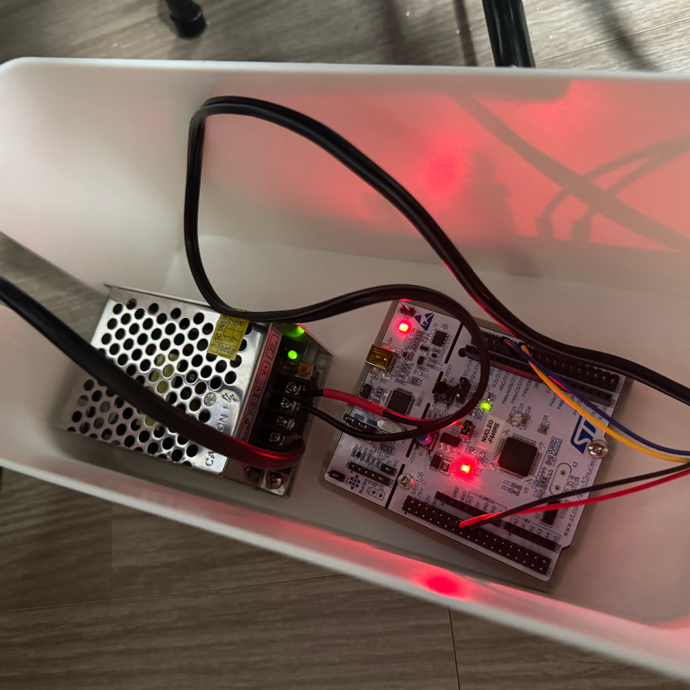

# XMAS-rusTree

Chritsmas tree lights written in Rust.

[](https://youtube.com/shorts/865onFjWOqE)

- led strip: apa102 (dotstar) 100ea
- board: [NUCLEO-F446RE](https://www.st.com/en/evaluation-tools/nucleo-f446re.html)
  - MCU: stm32f446ret6u



## Reference

build:
```sh
cargo build --release
```

flash:
```sh
cargo flash --release --chip STM32F446RETx --connect-under-reset
```

run:
```sh
probe-rs run --chip STM32F446RET --connect-under-reset target/thumbv7em-none-eabihf/release/xmas-rustree
```